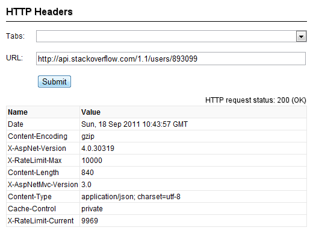
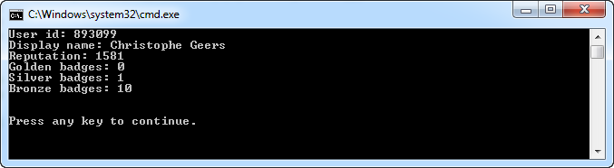
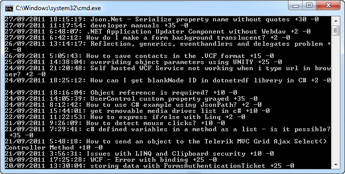

# Stack Exchange API

## Introduction

Two weeks ago I was playing around with the Stack Exchange API to see if it was easy to build a custom flair application. You know, this little guy:


How hard can it be to retrieve a user's profile, badge count and reputation updates? Surely, Stack Exchange has an API. And they do...and it's pretty easy to use. Let's quickly cobble together a small sample application.

## API Usage

You can find the documentation for the Stack Exchange API here:

[http://api.stackoverflow.com/](http://api.stackoverflow.com/)

At the time of writing the latest release is v1.1, but a [draft specification](http://stackapps.com/questions/2588/draft-specification-for-api-v2-0) for version 2.0 has just been released.

What do you need to know about the API?

- It's read-only
- All API responses are JSON
- All responses are GZIP'd
- API usage is throttled by IP address

API usage is throttled? Yup, each IP address gets 300 daily requests (No matter how many applications you run behind this IP address). However, if you [register your application](http://stackapps.com/apps/register) you receive an API key and you get 10.000 daily requests. You just need to append this key to each of your requests.

Each response you receive includes your maximum and current limits. Those numbers are stored in the HTTP headers. Let's inspect them (X-RateLimit-Max & X-RateLimit-Current).



You'd expect the X-RateLimit-Current count to decrement by 1 with each request, however sometimes you'll receive duplicate numbers. I reported this on [StackApps](http://stackapps.com/questions/2592/current-rate-limit-not-always-decrementing), but haven't received a reply as to why this happens.

So what do we need to be able to use the API?

- It talks JSON? Fire up [NuGet](http://www.nuget.org/) and get the popular [Json.NET](http://james.newtonking.com/pages/json-net.aspx) library.
- We'll need to issue requests. Let's keep it simple and use the [HttpWebRequest class](http://msdn.microsoft.com/en-us/library/system.net.httpwebrequest.aspx)
- All responses are GZIP'd? Luckily the .NET framework provides us with the [GZipStream class](http://msdn.microsoft.com/en-us/library/system.io.compression.gzipstream.aspx).

Time for action.

## User Profile

Let's start by retrieving the user's profile. You can retrieve it using the "[users/{id}](http://api.stackoverflow.com/1.1/usage/methods/users-by-ids)" API method. It takes a bunch of parameters, but we are only interested in one parameter, namely the user id (id parameter).

Just type in the following URL in your address bar to see an example response:

[http://api.stackoverflow.com/1.1/users/893099](http://api.stackoverflow.com/1.1/users/893099)

It looks something like this (I've shortened it here for illustrative purposes):

```json
{
  "total": 1,
  "page": 1,
  "pagesize": 30,
  "users": [
    {
      "user_id": 893099,
      "user_type": "registered",
      "display_name": "Christophe Geers",
      "reputation": 1581,
      "last_access_date": 1317546569,
      "location": "Belgium",
      "badge_counts": {
        "gold": 0,
        "silver": 1,
        "bronze": 10
      }
    }
  ]
}
```

You can retrieve a profile for one or more users with a single request. Most of the API's methods are vectorized. They accept multiple values within a single parameter on a request. You just need to separate them by semi-colons.

The format for a response is alway the same, they are paged. At the root you'll find the paging information (total, page, pagesize) and then you'll find an array which contains the information you requested. Here this information is contained within the users array. Take a mental note of this, we'll get back to it later.

Let's create a simple class into which we can deserialize a user's profile. It's decorated with attributes so we can easily deserialize / serialize it using Json.NET.

```csharp
[WrapperObject("users")]
[JsonObject(MemberSerialization.OptIn)]
public class User
{
    [JsonProperty(PropertyName = "user_id")]
    public int Id { get; internal set; }

    [JsonProperty(PropertyName = "display_name")]
    public string DisplayName { get; internal set; }

    [JsonProperty(PropertyName = "reputation")]
    public int Reputation { get; internal set; }

    [JsonProperty(PropertyName = "badge_counts")]
    public BadgeCounts BadgeCounts { get; set; }
}
```

The BadgeCount class looks like this:

```csharp
[JsonObject(MemberSerialization.OptIn)]
public class BadgeCounts
{
    [JsonProperty(PropertyName = "gold")]
    public int Gold { get; set; }

    [JsonProperty(PropertyName = "silver")]
    public int Silver { get; set; }

    [JsonProperty(PropertyName = "bronze")]
    public int Bronze { get; set; }
}
```

Did you notice the WrapperObject attribute on the User class? This is just a simple attribute that contains the name of the array in the JSON response which contains the data we are interested in. We'll need this when deserialing the data.

```csharp
[AttributeUsage(AttributeTargets.Class, AllowMultiple = false, Inherited = false)]
public class WrapperObjectAttribute : Attribute
{
    public WrapperObjectAttribute(string wrapperObject)
    {
        this.WrapperObject = wrapperObject;
    }

    public string WrapperObject { get; set; }
}
```

## Sending Requests

Ok, we've layed the foundation. Time to send a request which retrieves the user's profile. Create a class called StackExchangeApi and add the following code to it.

```csharp
public class StackExchangeApi
{
    private const string ApiVersion = "1.1";
    private const string BaseUri = "http://api.stackoverflow.com/" + ApiVersion;
    private readonly string _apiKey;

    public StackExchangeApi(string apiKey)
    {
        this._apiKey = apiKey;
    }

    public User GetUser(int userId)
    {
        return GetStackExchangeObject<User>(
            String.Format("/users/{0}", userId));
    }
}
```

To retrieve a user's profile the consumer of this class only has to write two lines of code.

```csharp
var api = new StackExchangeApi("your api key");
var user = api.GetUser(893099);
```

Let's complete the StackExchangeApi class. Add the private method GetStackExchangeObject(...) to this type.

```csharp
private T GetStackExchangeObject<T>(string path) where T : class, new()
{
    var requestUri = ComposeUri(path);
    var json = GetResponse(requestUri);
    return ParseJson<T>(json).FirstOrDefault();
}
```

The GetStackExchangeObject(...) method's responsibility is to retrieve one object from a response. For the GetUser(...) method we are only interested in one single user profile.

First it composes the Uri ([http://api.stackoverflow.com/1.1/users/893099?key=YourApiKey](http://api.stackoverflow.com/1.1/users/893099)) it needs to call using the ComposeUri(...) method.

```csharp
private string ComposeUri(string path)
{
    var uri = String.Format("{0}{1}", BaseUri, path);
    if (!String.IsNullOrWhiteSpace(this._apiKey))
    {
        var separator = uri.Contains("?") ? "&" : "?";
        uri = String.Format("{0}{1}key={2}", uri, separator, this._apiKey);
    }
    return uri;
}
```

Then it actually sends out the request and parses the response (GetResponse(...) method).

```csharp
private string GetResponse(string requestUri)
{
    var request = (HttpWebRequest) WebRequest.Create(requestUri);
    request.Method = WebRequestMethods.Http.Get;
    request.Accept = "application/json";
    var json = ExtractJsonResponse(request.GetResponse());
    return json;
}
```

It uses a simple HttpWebRequest to send the request. Afterwards you need to extract the JSON data from the response. Remember that all the responses are GZIP'd. Let's examine the ExtractJsonRespone(...) method.

```csharp
private string ExtractJsonResponse(WebResponse response)
{
    string json;
    using (var outStream = new MemoryStream())
    using (var zipStream = new GZipStream(response.GetResponseStream(),
        CompressionMode.Decompress))
    {
        zipStream.CopyTo(outStream);
        outStream.Seek(0, SeekOrigin.Begin);
        using (var reader = new StreamReader(outStream, Encoding.UTF8))
        {
            json = reader.ReadToEnd();
        }
    }
    return json;
}
```

The HttpWebRequest instance returns the response in the form of a stream. By wrapping this stream in a GZipStream we can easily unzip the response and get a hold of the JSON data.

OK, we've got the JSON data. Now we need to to deserialize it into a User instance. This is were the generic parameter passed to the GetStackExchangeObject(...) method comes into play. The GetUser(...) method passed the User type to it. This is then passed on to the ParseJson(...) method.

```csharp
private static IEnumerable<T> ParseJson<T>(string json) where T : class, new()
{
    var type = typeof (T);
    var attribute = type.GetCustomAttributes(
        typeof (WrapperObjectAttribute), false).SingleOrDefault() as
        WrapperObjectAttribute;
    if (attribute == null)
    {
        throw new InvalidOperationException(
            String.Format("{0} type must be decorated with a
            WrapperObjectAttribute.", type.Name));
    }

    var jobject = JObject.Parse(json);
    var collection = JsonConvert.DeserializeObject<List<T>>
        (jobject[attribute.WrapperObject].ToString());
    return collection;
}
```

The ParseJson(...) method first checks if you decorated the type (T) with a WrapperObjectAttribute. It needs this information so that it knows the name of the array in the JSON response which actually contains the data we are interested in. Then it deserializes this array to a collection of T (`List<T>`). The GetStackExchangeObject(...) method then returns the first object contained within this collection. Since we only requested the profile for one user it only contains one object.

It's now very easy to retrieve a user's profile.

```csharp
var api = new StackExchangeApi("your api key");

var user = api.GetUser(893099);

Console.WriteLine(String.Format("User id: {0}", user.Id));
Console.WriteLine(String.Format("Display name: {0}", user.DisplayName));
Console.WriteLine(String.Format("Reputation: {0}", user.Reputation));
Console.WriteLine(String.Format("Golden badges: {0}", user.BadgeCounts.Gold));
Console.WriteLine(String.Format("Silver badges: {0}", user.BadgeCounts.Silver));
Console.WriteLine(String.Format("Bronze badges: {0}", user.BadgeCounts.Bronze));
Console.WriteLine();
```

The output:



## Reputation Changes

Ok, we've got the user's profile. Now let's get a list of his / her reputation changes (or updates). You can retrieve this information using the "[/users/{id}/reputation](http://api.stackoverflow.com/1.1/usage/methods/user-reputation-changes)" API method.

A response looks as follows:

```json
{
  "total": 59,
  "page": 1,
  "pagesize": 30,
  "rep_changes": [
    {
      "user_id": 893099,
      "post_id": 7555096,
      "post_type": "answer",
      "title": "Json.Net - Serialize property name without quotes",
      "positive_rep": 30,
      "negative_rep": 0,
      "on_date": 1317147319
    },
    {
      "user_id": 893099,
      "post_id": 7546079,
      "post_type": "answer",
      "title": "developer manuals",
      "positive_rep": 35,
      "negative_rep": 0,
      "on_date": 1317122274
    }
  ]
}
```

The data we are interested in is stored in the rep_changes array. However, this time were are interested in all the items of this array. Let's create a simple C# class in which we can store a reputation change.

```csharp
[WrapperObject("rep_changes")]
[JsonObject(MemberSerialization.OptIn)]
public class ReputationChange
{
    [JsonProperty(PropertyName = "user_id")]
    public int UserId { get; set; }

    [JsonProperty(PropertyName = "post_id")]
    public int PostId { get; set; }

    [JsonProperty(PropertyName = "post_type")]
    public string PostType { get; set; }

    [JsonProperty(PropertyName = "title")]
    public string Title { get; set; }

    [JsonProperty(PropertyName = "negative_rep")]
    public int NegativeReputation { get; set; }

    [JsonProperty(PropertyName = "positive_rep")]
    public int PossitiveReputation { get; set; }

    [JsonProperty(PropertyName = "on_date")]
    [JsonConverter(typeof(UnixDateTimeConverter))]
    public DateTime OnDate { get; set; }
}
```

**Remark**: The UnixDateTimeConverter type is not a default Json.NET converter. It's a custom converter I created that's able to deserialize / serialize Unix timestamps. Read my previous post "[Writing a custom Json.NET DateTime Converter](https://github.com/geersch/JsonNetDateTimeConverter)" to see how it works.

We're almost there. Add the following method to the StackExchangeApi class.

```csharp
public IEnumerable<ReputationChange> GetReputationChanges(int userId,
  DateTime fromDate, DateTime toDate)
{
    var path = String.Format(
        "/users/{0}/reputation?fromdate={1}&todate={2}", userId,
        fromDate.ToUnixTime(), toDate.ToUnixTime());

    return GetStackExchangeObjects<ReputationChange>(path);
}
```

You can now easily retrieve the user's reputation changes. For example, let's retrieve the updates for the last two weeks:

```csharp
var api = new StackExchangeApi("your api key");
var reputation = api.GetReputationChanges(893099,
    DateTime.Now.AddDays(-14), DateTime.Now);
```

The private GetStackExchangeObjects(...) method called by the ReputationChanges method is almost identical to the GetStackExchangeObject(...) method. It reuses all the code we wrote earlier, but it returns a collection of T instead of a single T.

```csharp
private IEnumerable<T> GetStackExchangeObjects<T>(string path) where T : class, new()
{
    var requestUri = ComposeUri(path);
    var json = GetResponse(requestUri);
    return ParseJson<T>(json);
}
```

Voila, that's it. You can now retrieve a user's reputation changes.

```csharp
var api = new StackExchangeApi("your api key");
var reputation = api.GetReputationChanges(893099,
    DateTime.Now.AddDays(-14), DateTime.Now);
foreach(var change in reputation)
{
    Console.WriteLine(String.Format("{0}: {1} +{2} -{3}",
    change.OnDate, change.Title,
    change.PossitiveReputation,
    change.NegativeReputation));
}
```

The output:



You can now easily retrieve a user's profile and reputation changes. You can add support for the remaining API methods if you like. To implement them just follow the same pattern as shown here.
